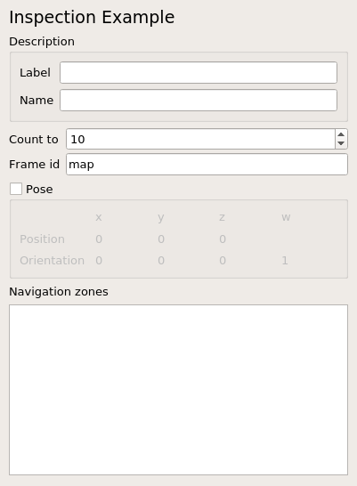

\page page_inspection_example_qt_plugin Inspection Example QT Plugin

# Inspection Example QT Plugin

## Overview

This package contains the example inspection QT plugin. It provides the plugin and QWidget for the inspection setup GUI. 

## Requirements

To build this package you have to install the following debian packages.

```
sudo apt update
sudo apt install ros-$ROS_DISTRO-environment-item-qt-dev ros-$ROS_DISTRO-environment-item-qt-ros-dev ros-$ROS_DISTRO-environment-item-ros-dev ros-$ROS_DISTRO-environment-utils-dev ros-$ROS_DISTRO-message-logger-dev ros-$ROS_DISTRO-pluginlib ros-$ROS_DISTRO-inspection-example-dev ros-$ROS_DISTRO-inspection-example-msgs-dev
```

## Plugin

The plugin provides methods to create a shared base pointer of the `inspection_example::Item`, 
create an item widget, read the items from the Ros parameter server and convert an item to an XmlRpc value.

## Widget

This is a QWidget and contains an input field for each member of the `inspection_example::Item`.


