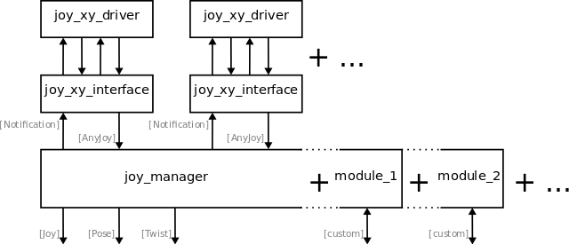
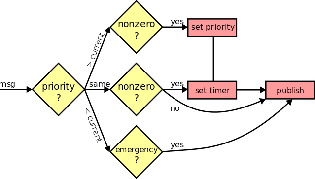

# JoyManager

With this package, multiple joysticks to operate ANYmal are managed and
prioritized to generalize their handling.


**Author(s):** Linus Isler, Christian Gehring  


## Overview



### Prioritization

The JoyManager connects with different joystick interfaces that are specified in
 the config file via AnyJoy messages and Notification messages. It then
forwards the highest prioritized joystick as a sensor_msgs/Joy.msg on the
`/joy_throttle` topic.

If the highest prioritized joystick no longer sends messages or they contain
values equal to zero for a certain time, the second highest joystick takes over
and is transmitted.

An incomming AnyJoy message runs through the following program:



An exception is made for emergency calls: If an emergency
call (either a hard or a soft stop) is received  from any of the joysticks, an
empty message is sent on the `hard_emcy_stop`, respectively `soft_emcy_stop`
topic immediately.

### Modules

To avoid an overabundance of dependencies, the joy_manager package is organized
with the ROS [pluginlib]. Different modules for different packages are loaded by
 the joy_manager and can be accessed from the joystick interfaces with commands
as a part of the AnyJoy messages.

Each module has to inherit from the **ModuleBase** class and contain the
following macro in its file:

```c++
PLUGINLIB_EXPORT_CLASS(joy_manager::[ModuleName], joy_manager::ModuleBase)
```

Also, an xml-file that links to the base class is necessary for catkin to load
the modules. It is named after the module package and contains the code:

```xml
<library path="lib/lib[module_package]">
  <class type="joy_manager::[ModuleName]" base_class_type="joy_manager::ModuleBase">
  <description>
    This is the description.
  </description>
  </class>
</library>
```

Finally, the package.xml needs an export tag:

```xml
<export>
  <joy_manager plugin="${prefix}/[module_package].xml" />
</export>
```

As of now, the following modules are already implemented:

- Motion Control Module in package ```joy_motion_control```
- PDB Module in package ```joy_pdb```
- Lowlevel Controller Module in package ```joy_anymal_lowlevel_controller```
- State Estimation Module in package ```joy_state_estimation```

To specify which modules are loaded when starting the JoyManager,
they have to be listed in the config file of the JoyManager under the modules parameter.


## Nodes

### JoyManager

The main node without all the modules loaded.


#### Subscribed Topics

* **anyjoy/joysticks** ([joy_manager_msgs/AnyJoy])

  The joystick axes, buttons, modules and commands for specified joysticks.

* **twist_min**, **twise_max** ([geometry_msgs/TwistStamped])

  The minimal and maximal velocities that are currently possible to command.

* **pose_min**, **pose_max** ([geometry_msgs/PoseStamped])

  The minimal and maximal poses that are currently possible to command.


#### Published Topics

* **/notifications** ([notification_msgs/Notifications])

  The reaction to commands is sent to the joystick interfaces via notifications.

* **/commands/joy** ([sensor_msgs/Joy])

  The axes and buttons from the currently prioritized joystick.

* **/commands/twist** ([geometry_msgs/TwistStamped])

  The mapped velocity from the currently prioritized joystick inputs.

* **/commands/pose** ([geometry_msgs/PoseStamped])

  The mapped pose from the currently prioritized joystick inputs.

* **/hard_emcy_stop** ([std_msgs/Empty])

  A hard emergency was detected by one of the joysticks.

* **/soft_emcy_stop** ([std_msgs/Empty])

  A soft emergency was detected by one of the joysticks.


#### Parameters

* **Joysticks** (struct {name, topic, priority})

  Each joystick has to be defined here. Cannot be empty and priorities have to
  differ.

* **Modules** (list of strings)

  Contains the class names of the different modules that should be loaded.

* **Timer** (double, default: 5.0)

  Seconds that pass before the priority is reset for all incomming messages.

* **Timeout** (double, default: 5.0)

  Seconds that pass before the last received message is no longer repeated

* **Spinrate** (double, default: 10.0)

  Overall frequency of publication of the messages.


### ROS Tests

Run the ros tests with

```bash
  rostest joy_manager joy_manager.test
```


[std_srvs/Empty]: http://docs.ros.org/api/std_srvs/html/srv/Empty.html
[pluginlib]: http://wiki.ros.org/pluginlib
[geometry_msgs/PoseStamped]: http://docs.ros.org/api/geometry_msgs/html/msg/PoseStamped.html
[geometry_msgs/TwistStamped]: http://docs.ros.org/api/geometry_msgs/html/msg/TwistStamped.html
[notification_msgs/Notifications]: https://bitbucket.org/leggedrobotics/any_common
[joy_manager_msgs/AnyJoy]: joy_manager_msgs/msg/AnyJoy.msg
[sensor_msgs/Joy]: http://docs.ros.org/api/sensor_msgs/html/msg/Joy.html
[std_msgs/Empty]: http://docs.ros.org/api/std_msgs/html/msg/Empty.html
